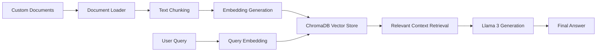

# RAG System using Llama 3, LangChain, and ChromaDB

This project is a Retrieval-Augmented Generation system that enables question answering over custom documents using Llama 3, LangChain, and ChromaDB. The goal is to improve response grounding by retrieving relevant document context before generating an answer, instead of relying only on the model’s pre-trained knowledge.

## Live Demo

[Try the Hugging Face Space](https://huggingface.co/spaces/Venkatkoushik22/secure-local-rag-platform)

## Problem

Large language models can generate confident responses even when they do not have access to the right information. This project addresses that limitation by connecting the model to an external knowledge source and using retrieval to provide relevant context at query time.

## What I Built

* Built a document ingestion and text chunking pipeline
* Generated embeddings from document chunks for semantic search
* Stored and queried embeddings using ChromaDB
* Retrieved relevant context based on user queries
* Used Llama 3 to generate answers grounded in retrieved document context
* Tested the system using the EU AI Act as the source knowledge base

## How It Works

1. Documents are loaded and split into smaller chunks.
2. Each chunk is converted into an embedding.
3. The embeddings are stored in ChromaDB.
4. A user query is embedded and compared against stored document vectors.
5. The most relevant chunks are retrieved.
6. Retrieved context is passed to Llama 3.
7. The model generates a context-aware response.

## Architecture

## Tech Stack

| Component            | Technology                          |
| -------------------- | ----------------------------------- |
| Programming Language | Python                              |
| Large Language Model | Llama 3 8B Chat                     |
| Orchestration        | LangChain                           |
| Vector Database      | ChromaDB                            |
| Model Framework      | Hugging Face Transformers           |
| Data Processing      | Document loaders and text splitters |

## Evaluation

The system was tested using the EU AI Act as the document knowledge base. I compared responses generated with retrieved context against responses generated without retrieval, focusing on whether the answer was grounded in the source document.

The RAG-based approach reduced unsupported or hallucinated responses by 34% compared to standalone prompting. This improvement came from retrieving relevant source chunks before generation, which helped the model answer from provided context instead of relying only on pre-trained knowledge.

## Evaluation Approach

* Created a set of test questions based on the source document
* Compared standalone LLM responses against RAG-based responses
* Checked whether answers were supported by retrieved context
* Tracked failure cases where the model missed, guessed, or added unsupported information
* Used the results to refine chunking and retrieval quality

## Key Features

* Question answering over custom documents
* Semantic search using vector embeddings
* Context-aware response generation
* Modular RAG pipeline
* Extendable to legal, technical, academic, or enterprise documents

## Why This Project Matters

This project demonstrates how LLMs can be connected to external knowledge sources to make responses more reliable and context-aware. It reflects my interest in building AI systems that are not only functional, but also testable, explainable, and useful for real-world document-based workflows.

## Future Improvements

* Add a FastAPI or Streamlit interface
* Add SQL-backed evaluation tracking
* Add hallucination scoring and answer faithfulness metrics
* Support additional file formats such as PDF, TXT, and DOCX
* Add authentication for secure document access
* Improve retrieval quality with reranking

## Author

Built by Venkat Koushik Pillala as part of my work in Generative AI, LLM orchestration, and retrieval-based AI systems.

---

###  Results:

* Accurate and context-aware responses
* Strong grounding in retrieved documents
* Reduced hallucinations compared to standalone LLM usage
* Reliable question answering across legal text

---

##  Bonus Note

1. Efficiently fine-tune Llama 3 with PyTorch FSDP and Q-Lora : [Implementation Guide▶️](https://github.com/GURPREETKAURJETHRA/Meta-LLAMA3-GenAI-UseCases-End-To-End-Implementation-Guides/blob/main/GENAI_NOTEBOOKS/fsdp-qlora-distributed-llama3.ipynb)

2. Deploy Llama 3 on Amazon SageMaker : [Implementation Guide▶️](https://github.com/GURPREETKAURJETHRA/Meta-LLAMA3-GenAI-UseCases-End-To-End-Implementation-Guides/blob/main/GENAI_NOTEBOOKS/deploy-llama3.ipynb)

3. RAG using Llama3, Langchain and ChromaDB : [Implementation Guide 1▶️](https://github.com/GURPREETKAURJETHRA/Meta-LLAMA3-GenAI-UseCases-End-To-End-Implementation-Guides/blob/main/GENAI_NOTEBOOKS/rag-using-llama3-langchain-and-chromadb.ipynb)

4. Prompting Llama 3 like a Pro : [Implementation Guide▶️](https://github.com/GURPREETKAURJETHRA/Meta-LLAMA3-GenAI-UseCases-End-To-End-Implementation-Guides/blob/main/GENAI_NOTEBOOKS/prompting-llama-3-like-a-pro.ipynb)

5. Test Llama3 with some Math Questions : [Implementation Guide▶️](https://github.com/GURPREETKAURJETHRA/Meta-LLAMA3-GenAI-UseCases-End-To-End-Implementation-Guides/blob/main/GENAI_NOTEBOOKS/test-llama3-with-some-math-questions.ipynb)

6. Llama3 please write code for me : [Implementation Guide▶️](https://github.com/GURPREETKAURJETHRA/Meta-LLAMA3-GenAI-UseCases-End-To-End-Implementation-Guides/blob/main/GENAI_NOTEBOOKS/llama3-please-write-code-for-me.ipynb)

7. Run LLAMA-3 70B LLM with NVIDIA endpoints on Amazing Streamlit UI : [Implementation Guide▶️](https://github.com/GURPREETKAURJETHRA/LLAMA3-70B-LLM-with-NVIDIA)

8. Llama 3 ORPO Fine Tuning : [Implementation Guide▶️](https://github.com/GURPREETKAURJETHRA/Llama-3-ORPO-Fine-Tuning)

9. Meta's LLaMA3-Quantization : [Implementation Guide▶️](https://github.com/GURPREETKAURJETHRA/LLaMA3-Quantization)

10. Finetune Llama3 using QLoRA : [Implementation Guide▶️](https://github.com/GURPREETKAURJETHRA/Meta-LLAMA3-GenAI-UseCases-End-To-End-Implementation-Guides/blob/main/GENAI_NOTEBOOKS/finetune-llama3-using-qlora.ipynb)

11. Llama3 Qlora Inference : [Implementation Guide▶️](https://github.com/GURPREETKAURJETHRA/Meta-LLAMA3-GenAI-UseCases-End-To-End-Implementation-Guides/blob/main/GENAI_NOTEBOOKS/llama3-qlora-inference.ipynb)

12. Beam_Llama3-8B-finetune_task : [Implementation Guide▶️](https://github.com/GURPREETKAURJETHRA/Meta-LLAMA3-GenAI-UseCases-End-To-End-Implementation-Guides/blob/main/GENAI_NOTEBOOKS/Beam_Llama3-8B-finetune_task.py)

13. Llama-3 Finetuning on custom dataset with Unsloth : [Implementation Guide▶️](https://github.com/GURPREETKAURJETHRA/Meta-LLAMA3-GenAI-UseCases-End-To-End-Implementation-Guides/blob/main/GENAI_NOTEBOOKS/Llama-3_Finetuning_on_custom_dataset_with_unsloth.ipynb)
